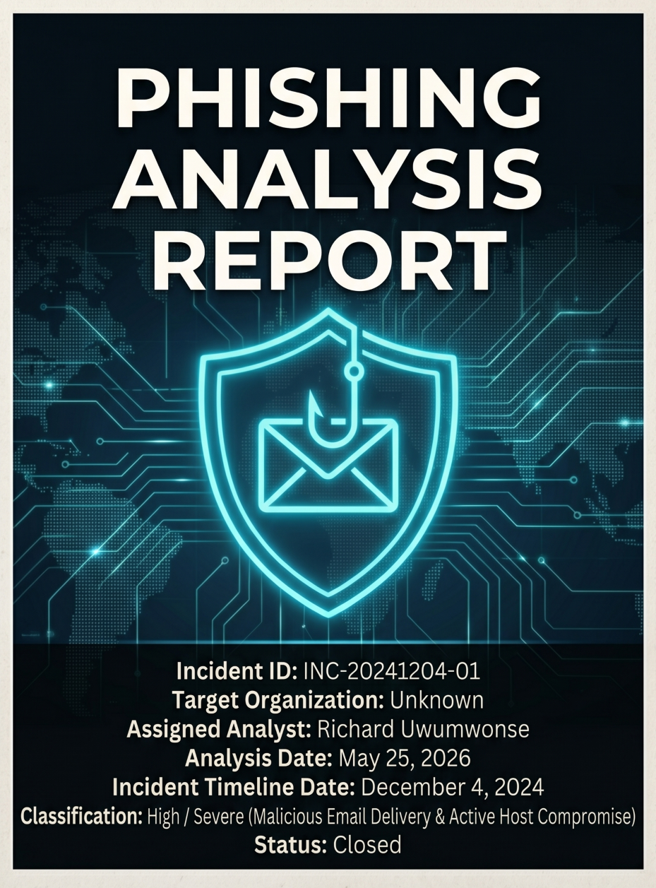
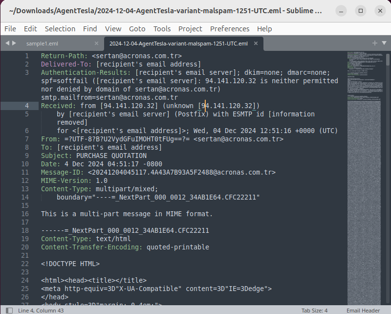
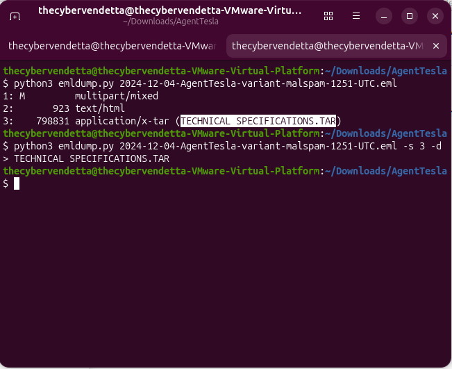
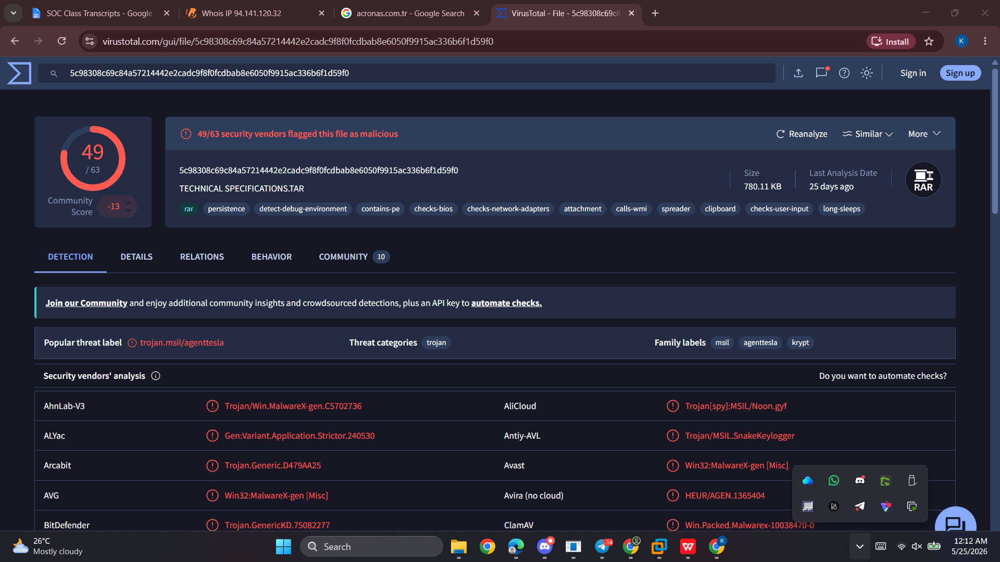
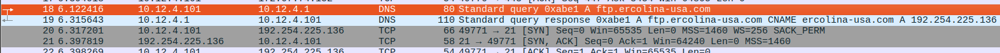
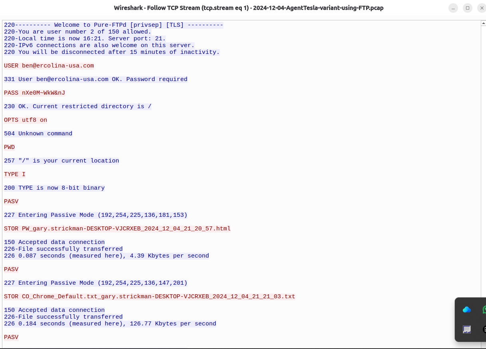
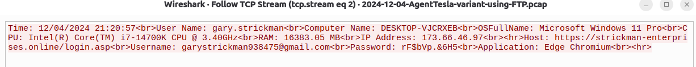

# AgentTesla Incident Response: A Dual-Phase Forensic Investigation

**Project:** Incident Response & Digital Forensics  
**Role:** SOC Analyst / Security Researcher  
**Technologies:** Wireshark (PCAP Analysis), Email Header Forensics, VirusTotal API, EDR Mitigation, DNS Sinkholing  

## 📌 1. Executive Summary
This case study details a comprehensive, dual-phase Incident Response investigation into a targeted Business Email Compromise (BEC) and malware infection. An endpoint was compromised by an information-stealer variant known as **AgentTesla**. This report breaks down the full attack lifecycle: starting from the static analysis of the spear-phishing delivery mechanism (Phase 1), through the dynamic PCAP network analysis of the data exfiltration channel (Phase 2), and concluding with actionable Indicators of Compromise (IOCs) for enterprise remediation.

---

## 📧 Phase 1: Phishing Email & Static Forensics

On December 4, 2024, a targeted malicious spam (malspam) email successfully breached an endpoint workstation using a supplier impersonation tactic.

### Domain Spoofing & Header Diagnostics
A forensic extraction of the raw email file (`.eml`) revealed critical tracking parameters:
*   **Spoofed Sender:** `sertan@acronas.com.tr`
*   **Originating MTA IP:** `94.141.120.52`
*   **Authentication Failures:** The SPF evaluation resulted in a `FAIL/SOFTFAIL` because the authoritative DNS records for the domain did not authorize the external IP `94.141.120.52`. The email completely lacked a DKIM cryptographic signature.

### The Malicious Payload & Defense Evasion
The attacker utilized a deceptive attachment named `TECHNICAL SPECIFICATIONS.TAR`. 

*   **Declared Extension:** `.TAR` (Tape Archive)
*   **True File Type:** `RAR Archive Data, v4`
*   **Evasion Tactic:** This mismatch is an intentional obfuscation technique designed to exploit flaws in Secure Email Gateways (SEG) that might scan `.rar` extensions but let `.tar` containers pass without deep inspection.

When the internal executable (`TECHNICAL SPECIFICATIONS.exe`) was hashed and queried against the VirusTotal API, it was flagged by 49 security vendors as an **AgentTesla Information Stealer**.

---

## 🌐 Phase 2: Dynamic Network Analysis (PCAP)

Following the detonation of the payload, the network layer officially transitioned from an idle state to actively compromised at `21:20:56 UTC`. 

### Host Profiling & DNS Mapping
The malware utilized standard system APIs to perform directed external domain resolutions designed to profile the target workstation.
*   **Suspicious DNS Queries:** An initial resolution request targeted `api.ipify.org`. The malware requested this highly reputable public web utility to check the endpoint's public-facing WAN address, mapping its environment before establishing a Command and Control (C2) channel.
*   **C2 Routing:** Exactly six seconds later, the malware fired a targeted DNS query for its external staging sub-domain: `ftp.ercolina-usa.com` (Resolved IP: `192.254.225.136`).

### FTP Exfiltration Traffic Analysis
The underlying AgentTesla binary was compiled using a completely unencrypted, standard File Transfer Protocol (FTP) staging library. The network packet capture recorded the entirety of the authentication loop and exfiltration operations in cleartext.

*   **Cleartext Connection:** Port 21 (Inbound Control Channel)
*   **Captured Username:** `ben@ercolina-usa.com`
*   **Captured Password:** `nXe0M~WkW&nJ`

### Exfiltration Data Dumps (STOR Commands)
The malware systematically forced the remote server into **Passive Mode (PASV)** to establish outbound data channels that bypass standard boundary firewalls. The network traffic uncovered two separate authentication logins logging four major data dumps:
1.  `PW_gary.strickman...html`: Exfiltration of plaintext application credentials, local host markers, and saved passwords.
2.  `CO_Chrome_Default.txt...` & `CO_Edge Chromium_Default.txt...`: Massive session hijacking dumps containing comprehensive cookie datastores extracted out of both Chrome and Edge.
3.  `KL_gary.strickman...html`: An active surveillance keylogger dump containing a plaintext capture of raw keyboard inputs, modified clipboards, and window contexts.

---

## 🛡️ Actionable Indicators of Compromise (IOC) & Remediation

To orchestrate immediate block and isolation defenses, the following absolute, verified network-based indicators were compiled to be fed directly into corporate perimeter firewalls, proxy appliances, and SIEM monitoring configurations:

| Indicator Type | Value / Signature String | Operational Remediation Action |
| :--- | :--- | :--- |
| **Domain Name** | `api[.]ipify[.]org` | Build monitoring alerts for non-browser binaries invoking this API. |
| **Domain Name** | `ftp[.]ercolina-usa[.]com` | Sinkhole domain queries at internal corporate DNS resolvers. |
| **IP Address** | `192.254.225.136` | Enforce absolute outbound IP block rules across edge firewalls. |
| **Account User** | `ben@ercolina-usa.com` | Feed string parameters into proxy content matching filter patterns. |
| **File Pattern** | `PW_*.html` / `CO_*.txt` / `KL_*.html` | Configure local EDR profiles to inspect and intercept matching file headers. |

## 🎯 Conclusion
This dual-phase investigation successfully tracked the AgentTesla threat from its initial spear-phishing ingress to its final cleartext FTP exfiltration phase. By dissecting both the static email headers and the dynamic network PCAP streams, a complete attack timeline was reconstructed, allowing for the deployment of targeted EDR and firewall remediation strategies.
